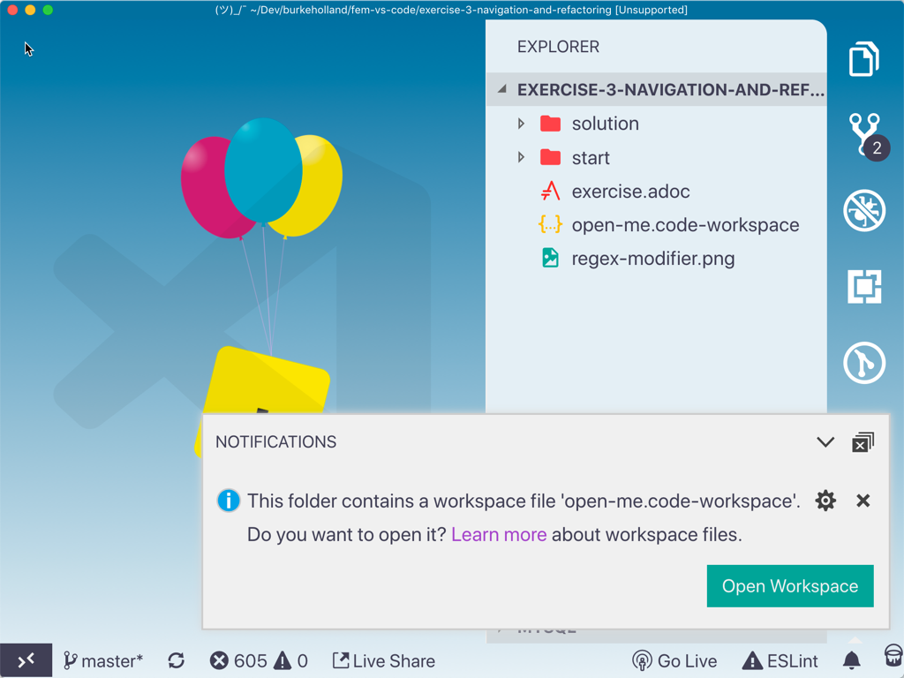
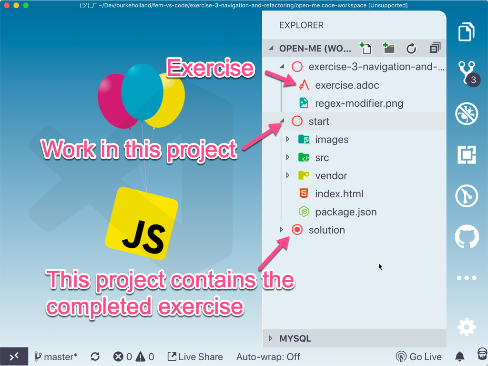
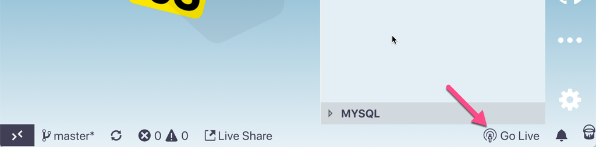
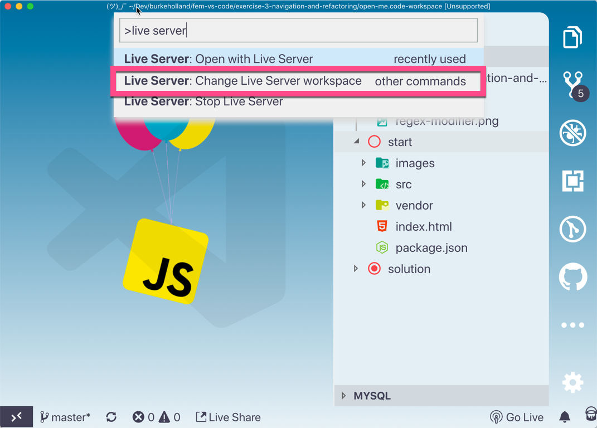
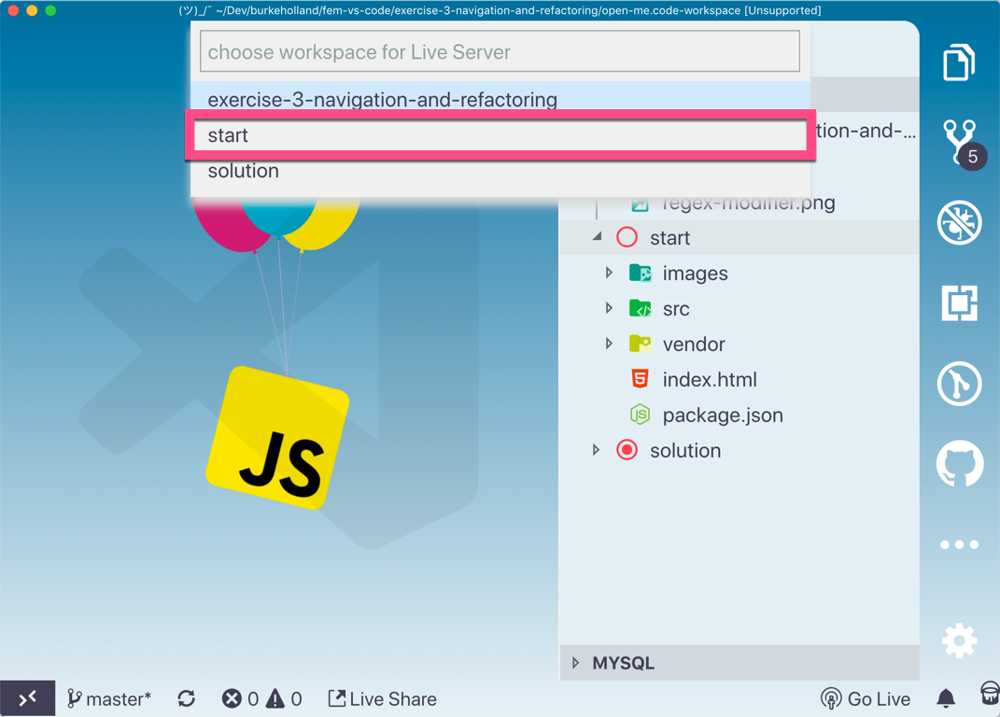

# VS Code Can Do That Workshop

These exercises are part of the "VS Code Can Do That" workshop from Front End Masters.

[aka.ms/vs-code-workshop](aka.ms/vs-code-workshop)

## Prerequisites

**These are important. You need to have these items installed to complete this workshop**

- [Git](https://git-scm.com/downloads)
- [Node(LTS)](https://nodejs.org/en/)
- [Docker Community Edition](https://docs.docker.com/install/)
- [VS Code Can Do That extension pack](https://marketplace.visualstudio.com/items?itemName=burkeholland.vs-code-can-do-that)

## Viewing the exercises

Each folder contains an `exercise.adoc` file. These are asciidoc files. To view them, open the command palette and select "AsciiDoc: Open Locked Preview to the Side". You can then close the `.ascidoc` file and just look at the preview.

## Running the exercises

Open the exercise in it's own instance of VS Code...

```
cd exercise-1-customizing-the-editor
code .
```

Some of the exercises contain multiple workspaces. This allows you to load multiple projects at the same time into VS Code. If this is the case, VS Code will prompt you. Select "Yes" to open the workspace file.



There will be a "start" project and a "solution" project in the workspace. Work in the "start" project and refer to the "solution" project for the finished exercise should you get stuck.



Some projects have a static `index.html` file that needs a web server to run. I have included an extension called "Live Server" that does just that. To start it, click on the "Go Live" button in the status bar.



Note that if you are working in an exercise with multiple workspaces, you'll need to make sure that Live Server is running against the "start" project and not the "solution". Open the Command Palette (Ctrl/Cmd + Shift + P) and select "Live Server: Change live server workspace"



Then select the "start" workspace.



Then click the "Go Live" button in the status bar.
