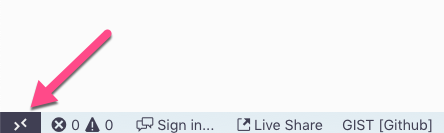

:doctype: article
:experimental: true

= 7. Working With Data

Open a new instance of VS Code on the "start" folder.

Click on the "Remote Development" icon in the bottom left-hand corner of the taskbar.

Select "Remote Development: Reopen Folder in Container"

== 1. Connect to Mongo DB

Connect to the local instance of Mongo DB.

.Solution
[%collapsible]
====
1. Open the Azure Cosmos DB extension
1. Expand "Attached Database Accounts"
1. Click "Attach Database Account"
1. Select "Mongo DB"
1. Type `mongodb://mongo:27017`
====

== Create a lamp database

Create a new Mongo DB database called "lamp" and a collection within it called "colors".

.Solution
[%collapsible]
====
----
1. Right-click the attached Mongo DB database and select "Create Database"
1. Enter "lamp" as the database name
1. Enter "colors" as the collection name
----
====

== Run the project

Run `npm install` and run the project. Update the lamp with a few colors.

.Solution
[%collapsible]
====
1. Open the integrated terminal with kbd:[Ctrl] / kbd:[Cmd] + kbd:[`]
1. Run `npm start`
1. Browse to "localhost:3000"
====

== Query the database

Use a Mongo DB Scrapbook to query the database and see the records

.Solution
[%collapsible]
====
1. Open the Cosmos DB extension and right-click the "lamp" database
1. Select "Connect"
1. kbd:[Ctrl] / kbd:[Cmd] + kbd:[Shift] + kbd:[P] 
1. Select "Cosmos DB: New Mongo Scrapbook"
1. Execute a `find` query to view the records...
----
db.colors.find()
----
====

