:experimental: true

== Git: Source Control

## 1. Fork the repo

Fork the following repo...

https://github.com/burkeholland/i-love-lamp

.Solution
[%collapsible]
====
* Navigate to https://github.com/burkeholland/i-love-lamp
* Click the "Fork" button in the upper right-hand corner
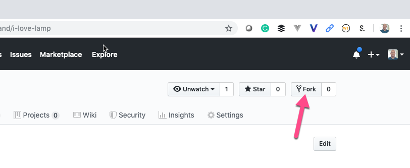
====

## 2. Clone the repo

Clone the repo that you forked using VS Code

.Solution
[%collapsible]
====
* Find the repo URL on Github by expanding the "Clone or download" button
image:images/clone-or-download.png[Clone or download]
* Open the Command Palette in VS Code (kbd:[Ctrl] / kbd:[Cmd] + kbd:[Shift] + kbd:[P])
* Type "Clone"
* Select "Git: Clone"
* Paste in the repo URL
* Select the "start" folder as the location
* Project will be cloned into a sub-folder called "i-love-lamp"
* Select "Open in New Window" when VS Code prompts
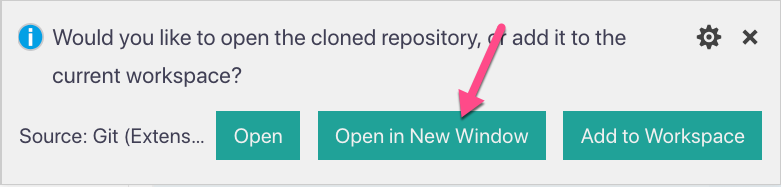
====

## 3. The most common workflow

The most common workflow for Github in VS Code, is to make changes to a file, stage those chages, commit them and then push to the upstream repository.

Change the description meta tag in the `index.html` file. Stage the  changes and then commit them to your repository.

.Solution
[%collapsible]
====
* Modify the description metatag in the `index.html` file
* Notice the blue gutter mark that VS Code uses to denote a pending change 
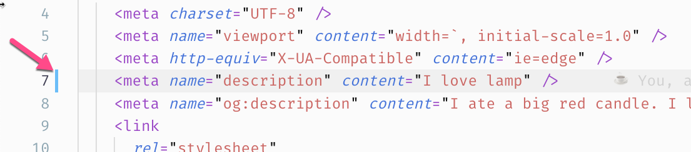
* Click on the blue rectangle and expand the change. Notice that you can undo the change directly from this view
* Open the Git sidebar explorer (kbd:[Ctrl] / kbd:[Cmd] + kbd:[Shift] + kbd:[G])
* Click the kbd:[+] sign next to the `index.html` file to stage it
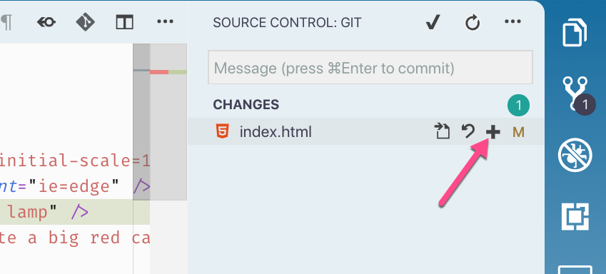
* Add a message to the commit box
* Press the checkmark to commit the changes
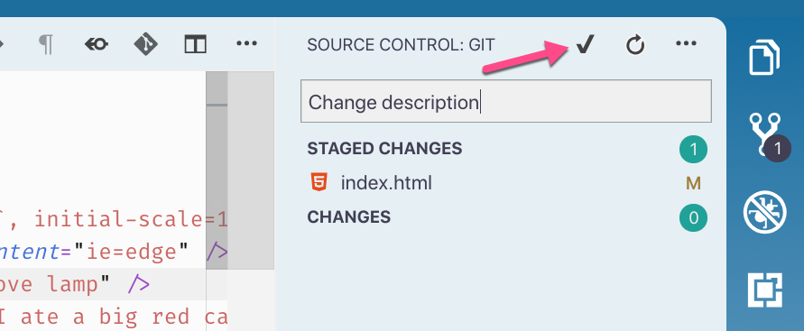
* Push the changes using the status bar button
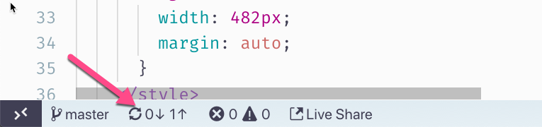
====

## 4. Create a new branch

Create a new branch using VS Code, make a change to the description meta tag in the `index.html` file and commit those to the new branch.

.Solution
[%collapsible]
====
* Click on the "master" branch button in the status bar
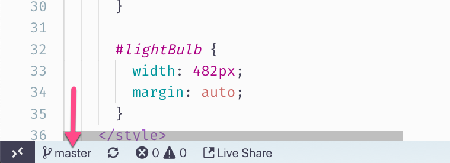
* Select "Create new branch"
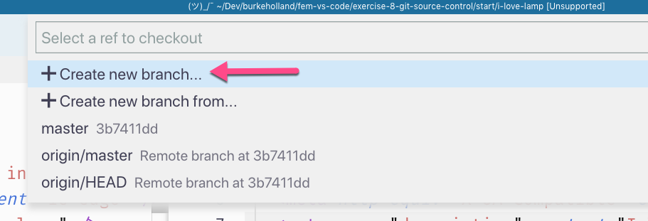
* Name it "new_branch"
* Modify the description meta tag in the `index.html` file.
* Stage the changes
* Commit the changes
* Publish the branch by click on the publish button in the status bar
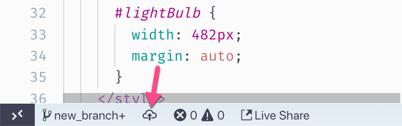
====

## 5. Merge new_branch to master

Change the "description" metatag in the master branch and then merge in the "new_branch". Delete the "new_branch".

.Solution
[%collapsible]
====
* Switch back to the "master" branch using the branch switcher in the status bar
* Change both the "description" and "og:description" meta tags to "I love lamp"
* Stage the changes
* Commit the changes
* Open the Command Palette (kbd:[Ctrl] / kbd:[Cmd] + kbd:[Shift] + kbd:[P])
* Type "merge"
* Select "Git: Merge Branch"
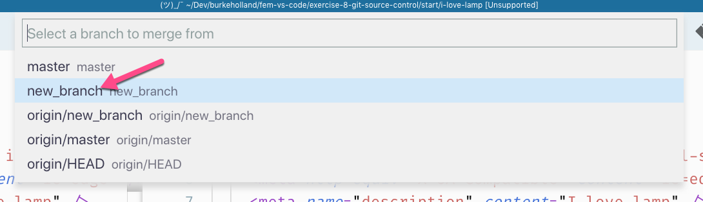
* VS Code will warn that there are merge conflicts
* View the merge conflicts on the `index.html` file
* Accept the incoming changes
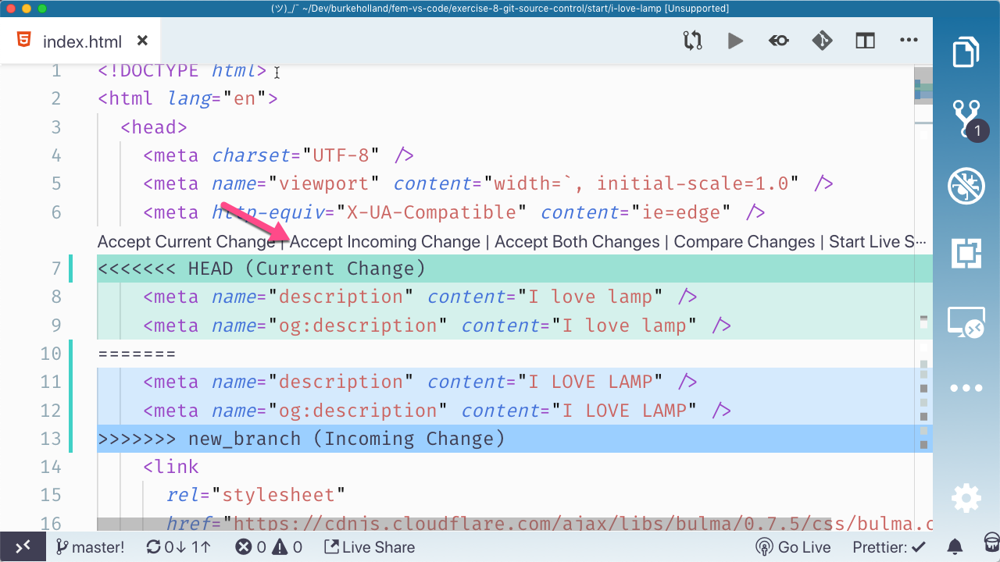
* Commit the index file
* Push to the upstream repository
====